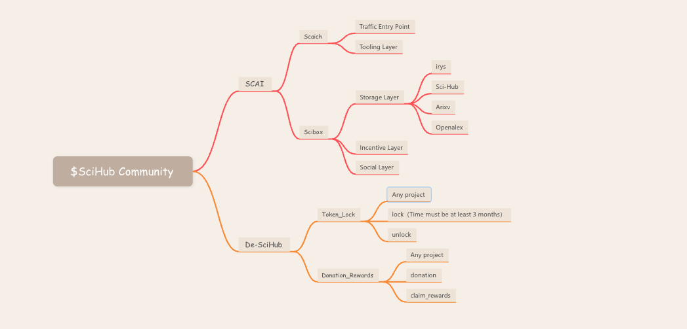

# SCAI

Website: [https://scai.sh]

App: [https://app.scai.sh]

Welcome to SCAI, a decentralized academic service provider reshaping the entire academic research lifecycle through AI and Web3 technologies. We aim to provide researchers with:

- ❤️ Efficient and low-cost publishing pathways
- 🫴 Practical academic tools
- 📚 A scholar-governed ecosystem

SCAI currently has no tokens, but in the foreseeable future, we will build a DAO using token-based voting.

SCAI is still in its early development stage, and we welcome everyone who shares our vision to join us in building it.

## Story

Scholars are a large and steadily growing group. As of 2025, the global number of higher education students is approximately 264 million. Among them, the total number of master’s and doctoral students worldwide is around 26.4–39.6 million.

Compared to other professions, scholars have unique needs. By 2025, the market for scholar services is valued at $32.1 billion. However, 90% of contributors receive no profits, while publishers dominate with profit margins as high as 35%–40%.

Even more astonishingly, unlike other service industries, publishing services lack competition in quality. Due to scholars’ reliance on publishing outcomes, their experience remains at a low level (e.g., lengthy review processes, page limits), completely failing to meet their actual needs.

Imagine if the profits from scholar services could be largely distributed to true contributors, including reviewers, editors, illustrators, and content auditors. With proper incentives, publishing efficiency and service quality could be accelerated, generating significant economic benefits.

## Tech

The technologies of AI and Web3 make this vision possible. Through smart contracts and decentralized storage, we can dismantle the data moats built by publishers; through AI tools and frameworks, we can replace manual processes with efficient literature review and management, ultimately achieving an open academic publisher governed by scholars.

- Through collaboration with Irys, we can achieve fully decentralized storage and computation at extremely low costs!

- By building a vector database of tens of millions of papers, we enable semantic search and article analysis!

- Through a unique multi-agent framework, we create tools and services for scholars!

## Products

- 🌐 Decentralized literature repository! (box.scai.sh)
- 🧠 Semantic-based academic search + literature management tool! (search.scai.sh)
- 🚀 Decentralized publishing service with scholar incentives! (press.scai.sh)
- In the future, we will have a [Foundation], [Research Dissemination/Commercialization Platform], [DID Forum], [Decentralized Scholar Profile], [Academic AI Tools], and more!

## Roadmap

## Contact Us

📧 Email: noreply@scai.sh  
🌐 Website: https://www.scai.sh/  
📢 Telegram: https://t.co/67N7cpQFen  
🐦 X: https://x.com/SCAI_Agent  

## Donation Addresses (SOL)

SCAI Foundation:  
9pjiPKiyDLHXRRGUu4udCceF3vj3EY6hZH3jdS9vEbkH  

Contract Core Contributor (keien):  
5beR4SfTQ4YRvUfUG5eDTic66nAntwAZzTqA6SqsZxkw
