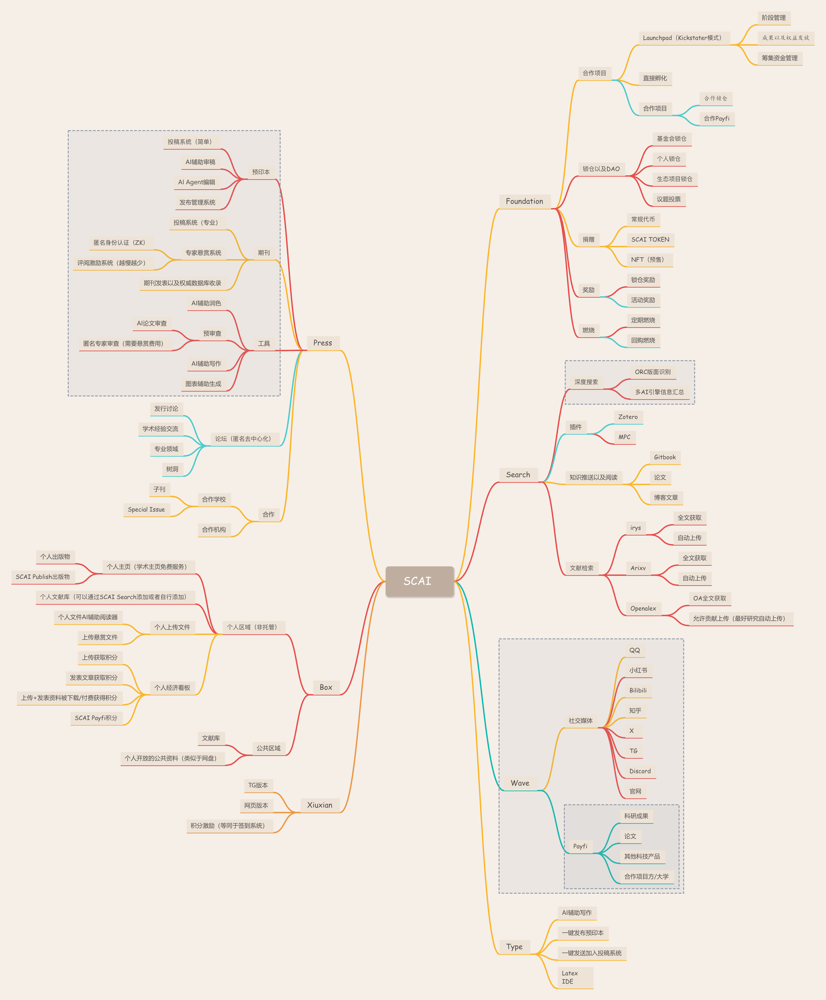

# SCAI

欢迎来到 SCAI，我们是一家去中心化的学术服务提供商，通过AI以及Web3技术的帮助，重塑整个学术研究生命周期。我们希望为研究者提供：

- ❤️ 高效且低价的出版路径

- 🫴 实用的学术工具

- 📚 学者自治的生态系统

SCAI 目前没有任何代币，但在可预见的将来，将会采用币权投票的方式构建DAO。

SCAI 还在早期建设阶段，我们欢迎每一个有相同愿景的人加入我们建设。

SCAI 是Irys官方的合作项目。

## 故事

学者是一个规模庞大，且稳定增加的群体。截至 2025 年，全球高等教育学生总数约为 2.64 亿人。其中全球硕士+博士在校生总数约为 2,640 万 – 3,960 万人。

学者相较于其他的职业，有着非常特殊的需求。截至 2025 年，学者服务的市场为321亿美元，然而，其中 90% 的贡献者没有收益，同时，出版商占据了生态中绝对的利润率，高达 35%-40%。

更加离奇的是，相较于其他服务行业，出版服务非但没有服务质量竞争，反而由于学者依赖出版成果，导致其体验长期停留在较低的水平（如长时间审稿、版面限制），完全不能匹配学者的真实需求。

设想，如果学者服务的利润能够大部分分配给真实贡献者，包括审稿、润色、图表、内容审核。通过合理的激励，加速出版效率，提高服务质量，将会带来大量的经济效益。

## 技术

AI和Web3的技术，使得这个愿景成为可能。通过合约以及去中心化存储，推倒出版商构建的数据护城河；通过AI工具以及框架，代替人工高效进行文献的审核以及管理，最终实现一个学者自治的的开放学术出版商。

- 通过与Irys的合作，我们能够采用极低的成本，达到完全去中心化的存储和计算！

- 通过构建多达数千万篇论文的向量数据库，进行语义搜索，文章分析！

- 通过独特的多智能体框架，构建学者工具以及学者服务！
  

## 产品

- 🌐 去中心化的文献库！（scibox.store）
  
- 🧠 基于语义匹配的学术搜索+文献入库管理工具！（search.scai.sh）
  
- 🚀 基于学者激励的去中心化出版服务！（press.scai.sh）
  
- 未来还会有【基金会】，【成果传播/转化平台】，【DID论坛】，【去中心化学者个人主页】，【学术辅助AI工具】等等！
  

## 📂 路线图

## 🧑‍💻 联系我们

📧 Email：noreply@scai.sh

🌐 Website：https://www.scai.sh/

📢 Telegram：https://t.co/67N7cpQFen

🐦 X：https://x.com/SCAI_Agent

## 🎁 捐赠地址 (SOL)

SCAI Fundation:
9pjiPKiyDLHXRRGUu4udCceF3vj3EY6hZH3jdS9vEbkH

Contract Core Contributor（keien）:
5beR4SfTQ4YRvUfUG5eDTic66nAntwAZzTqA6SqsZxkw

